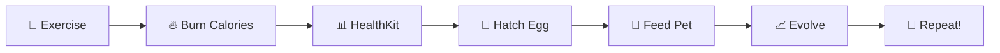

# 🥚 WorkoutEgg

<div align="center">


**A Tamagotchi-inspired virtual pet app for Apple Watch that grows based on your real-life calorie burn.**

*Burn calories in the real world → Feed your virtual pet → Watch it evolve!*

</div>

---

## 📱 Overview

**WorkoutEgg** is a gamified fitness motivation app that combines:

- 🏃 **Real-world exercise tracking** via HealthKit
- 🐣 **Virtual pet mechanics** inspired by Tamagotchi  
- 📈 **Evolution system** — your pet grows as you stay active
- ⚰️ **Consequences** — neglect your pet for 3 days and it dies!

The fundamental loop: **Exercise → Burn Calories → Hatch Egg → Feed Pet → Watch it Evolve**

---

## ✨ Features

| Feature | Description |
|---------|-------------|
| 🥚 **Egg Hatching** | Burn 200+ calories to hatch your egg into a baby pet |
| 🐾 **6 Evolution Stages** | Egg → Baby → Child → Teen → Adult → Elder |
| 🎭 **7 Emotions** | Pet mood changes based on your feeding streak |
| 🔥 **Streak System** | Maintain daily feeding streaks for happier pets |
| 💀 **Death Mechanics** | Miss 3 days and your pet dies (leaderboard saved) |
| 🏆 **Leaderboard** | Track your longest-lived pet record |
| 🔔 **Notifications** | Daily reminders to care for your pet |

---

## 🎮 How It Works



### Evolution Requirements

| Stage | Requirement |
|-------|-------------|
| Egg → Baby | Burn 200 kcal |
| Baby → Child | 7 days old |
| Child → Teen | 15 days old |
| Teen → Adult | 25 days old |
| Adult → Elder | 40 days old |

### Feeding System

| Daily Calories | Available Food |
|----------------|----------------|
| 0-200 kcal | No food |
| 201-400 kcal | 1 food item |
| 401-600 kcal | 2 food items |
| 600+ kcal | 3 food items |

---

## 🛠️ Tech Stack

| Technology | Purpose |
|------------|---------|
| **SwiftUI** | UI framework |
| **SpriteKit** | Animated pet scenes |
| **SwiftData** | Local data persistence |
| **HealthKit** | Active calorie tracking |
| **UserNotifications** | Push notifications |

---

## 📁 Project Structure

```
workoutegg/
├── .gitignore
├── README.md
├── $Reference/                    # Design references
├── WorkoutEgg/
│   ├── WorkoutEgg.xcodeproj/      # Xcode project
│   ├── Font/                      # Custom fonts (VCROSDMono)
│   ├── WorkoutEgg Watch App/      # Main app source
│   │   ├── Assets.xcassets/       # Images & colors
│   │   │   ├── Pet/               # Pet animations
│   │   │   ├── Egg/               # Egg images
│   │   │   ├── Food/              # Food items
│   │   │   └── background/        # Scene backgrounds
│   │   ├── ContentView.swift      # Main view controller
│   │   ├── GameScene.swift        # Pet display scene
│   │   ├── ProgressScene.swift    # Feeding scene
│   │   ├── StatusView.swift       # Stats display
│   │   ├── PetData.swift          # Pet data model
│   │   ├── PetManager.swift       # Pet lifecycle manager
│   │   ├── HealthKitManager.swift # HealthKit integration
│   │   └── UserNotification.swift # Notification manager
│   ├── WorkoutEgg Watch AppTests/
│   └── WorkoutEgg Watch AppUITests/
```

---

## 🚀 Getting Started

### Prerequisites

- Xcode 15.0+
- watchOS 10.0+ target
- Apple Watch (or Simulator)
- HealthKit entitlements

### Installation

1. **Clone the repository**
   ```bash
   git clone https://github.com/yourusername/workoutegg.git
   cd workoutegg
   ```

2. **Open in Xcode**
   ```bash
   open WorkoutEgg/WorkoutEgg.xcodeproj
   ```

3. **Configure signing**
   - Select your development team
   - Update bundle identifier if needed

4. **Run on device/simulator**
   - Select Apple Watch target
   - Build and run (⌘R)

### HealthKit Setup

The app requires HealthKit authorization for `activeEnergyBurned`. This is requested automatically on first launch.

---

## 🎨 Pet Species

| Species | Preview |
|---------|---------|
| **Kikimora** | Default starting pet |
| **Fufufafa** | *(Coming soon)* |
| **Bubbles** | *(Coming soon)* |
| **Sparkle** | *(Coming soon)* |

---

## 🐛 Known Issues

See the [detailed walkthrough](./docs/walkthrough.md) for a complete bug analysis. Key issues:

- [ ] Pet death system needs activation
- [ ] StatusView sync improvements needed
- [ ] Notification system expansion
- [ ] Species selection UI

---

## 📖 Documentation

| Document | Description |
|----------|-------------|
| [Walkthrough](./docs/walkthrough.md) | Full app architecture analysis |
| [API Docs](./docs/api.md) | *(Coming soon)* |

---

## 🤝 Contributing

1. Fork the repository
2. Create a feature branch (`git checkout -b feature/amazing-feature`)
3. Commit your changes (`git commit -m 'Add amazing feature'`)
4. Push to the branch (`git push origin feature/amazing-feature`)
5. Open a Pull Request

---

## 📄 License

This project is licensed under the MIT License - see the [LICENSE](LICENSE) file for details.

---

## 👨‍💻 Authors

- **Kenan Firmansyah** - *Lead Developer*
- **Alif Dimasius** - *UI/UX & SpriteKit*
- **Putu Swami Indira Dewi** - *Notifications*

---

## 🙏 Acknowledgments

- Inspired by the classic **Tamagotchi** virtual pets
- Built during **Apple Developer Academy** challenge
- Special thanks to the HealthKit and SwiftData teams at Apple

---

<div align="center">

**Made with ❤️ for Apple Watch**

*Get fit. Raise pets. Have fun!*

</div>
